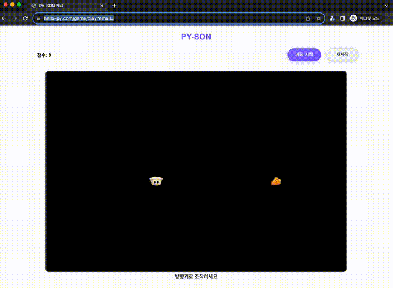

# PY-SON Snake Game Bot

<p align="center">
  
</p>

이 프로젝트는 **PyCon KR 2025**의 **Hello-Py** 부스에서 시연된 웹 스네이크 게임을 자동으로 플레이하는 봇입니다.  
Playwright를 사용하여 웹 브라우저를 제어하고, 경로 탐색 알고리즘을 통해 뱀의 움직임을 결정합니다.

타겟 게임은 다음 GitHub 저장소에서 확인하실 수 있습니다:
[HelloPy-Korea/hellopy-game](https://github.com/HelloPy-Korea/hellopy-game)

## 요구사항

- Python 3.8 이상
- `uv` (권장) 또는 `pip`

프로젝트에 필요한 라이브러리는 `requirements.txt` 파일에 명시되어 있습니다.

- `playwright`
- `opencv-python`
- `numpy`
- `pillow`
- `scikit-learn`

## 설치

1.  **저장소 클론:**
    ```bash
    git clone <repository-url>
    cd pycon25-hellopy-gamebot
    ```

2.  **가상 환경 생성 및 라이브러리 설치 (`uv` 사용 권장):**
    ```bash
    # uv 가상 환경 생성
    uv venv

    # 가상 환경 활성화
    source .venv/bin/activate

    # requirements.txt로 라이브러리 설치
    uv pip install -r requirements.txt
    ```

3.  **Playwright 브라우저 설치:**
    라이브러리 설치 후, Playwright가 제어할 브라우저 실행 파일을 설치해야 합니다.
    ```bash
    playwright install
    ```

## 사용법

프로젝트 루트 디렉토리에서 다음 명령어를 실행합니다.

```bash
python pyson_bot.py
```

프로그램이 실행되면, 사용하고자 하는 알고리즘(BFS 또는 A*)을 선택하라는 메시지가 표시됩니다. 알고리즘을 선택하면 브라우저가 실행되고 게임 페이지로 이동하며, 자동으로 게임을 플레이합니다.

## 프로젝트 구조

```
.
├── README.md
├── game.py                 # Playwright 브라우저 및 게임 환경 제어
├── pyson_bot.py            # 메인 실행 스크립트
├── requirements.txt        # Python 라이브러리 의존성
├── state_extractor.js      # 웹페이지에 주입되어 게임 상태를 추출하는 JS
├── solvers/                # 경로 탐색 알고리즘 (전략 패턴)
│   ├── __init__.py
│   ├── astar.py            # A* 알고리즘 솔버
│   ├── base.py             # 모든 솔버의 기본 클래스
│   └── bfs.py              # BFS 알고리즘 솔버
└── utils.py                # 보조 함수 모음
```

## 알고리즘 상세 설명

### BFS (너비 우선 탐색)

- 현재 위치에서 가장 가까운 칸부터 순서대로 탐색합니다.
- 음식에 도달하는 가장 짧은 경로를 탐색합니다.
- 경로를 찾지 못하면 안전한 방향으로 이동합니다.

### A* + 휴리스틱 검증 로직

- 음식까지의 직선 거리(맨해튼 거리)를 예측하여, 최적의 경로일 가능성이 높은 곳을 우선 탐색합니다.
- 경로 탐색 후, 해당 경로가 미래에 스스로를 가두는 함정인지 시뮬레이션을 통해 검증합니다.
- 안전한 음식 경로가 없으면, 생존을 위해 자기 꼬리를 쫓아가거나 가장 넓은 공간으로 이동하는 전략을 사용합니다.